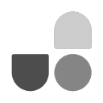
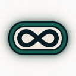
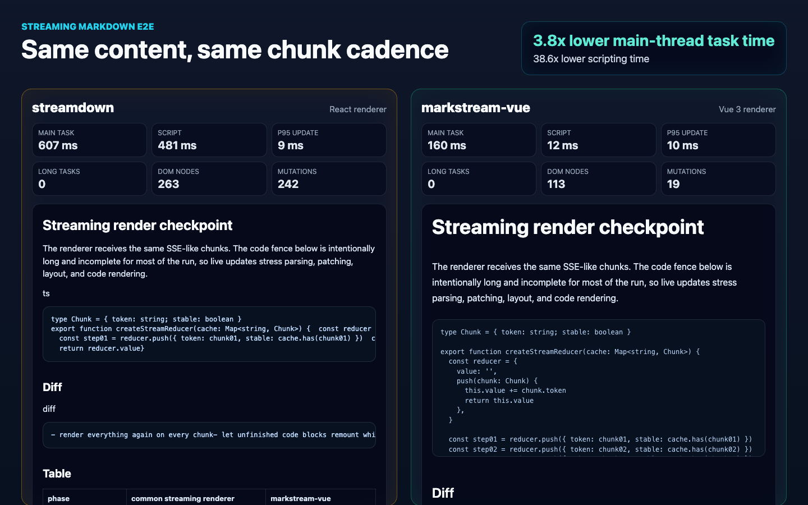
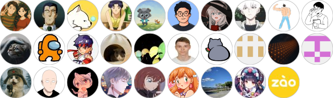

  

    # Answer
    content + final + smooth-streaming
    &lt;thinking&gt;Searching context...&lt;/thinking&gt;
    &lt;tool-result status="done"&gt;12 docs&lt;/tool-result&gt;
    &#96;&#96;&#96;vue
    &lt;MarkdownRender :content="content" /&gt;
    &#96;&#96;&#96;
    final=true
  

  

    
    
Vue 3 AI Output UI Layer

    <h1 class="hero-title">
      markstream-vue
    </h1>
    

      AI Streaming Markdown Renderer for Vue 3
    

  

  

    
<i></i><i></i><i></i>

    

      # Answer
      &#96;&#96;&#96;vue
      &lt;MarkdownRender custom-id="chat" :content="content" :final="final" smooth-streaming="auto" /&gt;
      &#96;&#96;&#96;
      &lt;thinking&gt;...&lt;/thinking&gt;
      &lt;tool-result&gt;...&lt;/tool-result&gt;
    

  

  
Simon He / Simon-He95

---

  

    
About Simon

    <h1>关于 Simon</h1>
  

  

    

      

        
      

      

        <strong>Simon He</strong>
        Simon-He95 · Shanghai
      

    

    

      
<strong>前端爱好者 / OSS contributor</strong>

      
关注 Vue、DX、AI UI、Streaming Rendering、VS Code 插件

      

        Maintainer
        UnoCSS
        DeepChat
        Vue Vine
      

      

        Author
        markstream-vue
        vscode-use
        awesome-compressor
      

      

        VS Code
        Common Intellisense
        UnoT
        Tailwind Magic
        To Tailwind
        Alias Jump
      

      

        Contributor
        Vite
        Element Plus
        TDesign Vue Next
      

    

  

  

    我不是想再造一个 Markdown 组件，而是想解决 AI 输出从 token 到 UI 的最后一公里。
  

---

  

    
从格式到协议

    <h1>Markdown 从一张纸，变成一条正在发生的流。</h1>
  

  

    

      Before
      

        # Report
        <i></i><i></i><i></i><i></i>
      

      
完成后再渲染

    

    

      #
      token
      &lt;tool&gt;
      |
    

    

      Now
      

        <b>AI Output Protocol</b>
        content
        thinking
        tool-result
      

      
边生成，边成为 UI

    

  

  

    从"渲染文档"到"渲染生成过程"。
  

---

  

    
流式渲染真正的问题

    <h1>观众看到的不是答案。 是答案诞生的现场。</h1>
  

  

    

      
<i></i><i></i><i></i>

      

        &#96;&#96;&#96;ts
        const answer = await agent.run(
        &nbsp;&nbsp;"summarize latest context"
        |
      

      

        namescore
        parser...
      

      
Mermaid block waiting

    

    

      
01<b>半截代码块</b><em>语法还没闭合</em>

      
02<b>跳动的结构</b><em>表格和公式还在改形</em>

      
03<b>重型节点</b><em>Mermaid / KaTeX / Monaco 抢主线程</em>

    

  

  

    传统 Markdown renderer 假设输入已经完成；AI 时代，用户盯着的是中间态。
  

---

  

    
传统 renderer 崩在哪

    <h1>这不是把 Markdown 变成 HTML。 这是把 token 养成稳定 UI。</h1>
  

  

    

      
    

    

      Markdown Renderer
      <b>complete markdown</b>
      <i>HTML</i>
    

    

      AI Streaming Renderer
      <b>token stream</b>
      <i>stable interactive UI</i>
    

  

  

    

      whole-block update
      
每个 chunk 触发全量重渲染 → remount → scroll jump → selection 丢失

    

    

      stable node identity
      
只更新增长的 live nodes，保留 DOM 身份、滚动位置和用户选择

    

  

  

    AI Streaming Renderer 关心的不是"渲染一次"，而是让每个增长中的节点保持稳定身份。
  

---

  

    
Live Demo

    <h1>一条 SSE，不应该只是刷字。 它会逐帧变成界面。</h1>
  

  

    

      
<i></i><i></i><i></i>

      

        frame 01 · intent
        

          event: token
          data: &lt;thinking&gt;Searching docs...&lt;/thinking&gt;
        

        
先接住"正在思考"。

      

      

        frame 02 · structure
        

          data: &#96;&#96;&#96;ts
          data: const answer = await agent.run()
          data: &#96;&#96;&#96;
        

        
未闭合代码块也能站住。

      

      

        frame 03 · commit
        

          event: done
          data: final=true
        

        
完成时稳定落地。

      

    

    

      
<b>localhost:3030</b>

      

        

          Thinking
          <b>Searching docs</b>
        

        

          Tool result
          <b>12 related documents</b>
        

        <pre class="inline-code" v-click><code>const answer = await agent.run()</code></pre>
        

          Final
          <b>final=true 后消息稳定落地</b>
        

      

    

  

  

    content append → incomplete parse → stable heavy blocks → custom tags → final commit
  

---

  

    
Same Content · Different Engine

    <h1>同一段输出，同一份 token，差异直接出现在交互里。</h1>
  

  <StreamingRenderPlay />

---

  

    
核心实现

    <h1>不是每个 chunk 全量重渲染。 增长中的节点才有资格被更新。</h1>
  

  

    

      01
      <b>chunk buffer</b>
      
追加 token

    

    

      02
      <b>incomplete parse</b>
      
未闭合也能解析

    

    

      03
      <b>stable live nodes</b>
      
保持节点身份

    

    

      04
      <b>update scheduler</b>
      
控制提交节奏

    

    

      05
      <b>final commit</b>
      
完整结构稳定落地

    

  

  

    

      <b>文本走快路径</b>
      cheap text append
    

    

      <b>重型节点排队</b>
      靠近视口再渲染
    

    

      <b>交互状态保留</b>
      selection / scroll 不丢
    

  

  

    优化目标：更少 parse、更少 DOM mutation、更少 heavy block 抢主线程。
  

---

  

    
调度与节奏

    <h1>transport chunk 不直接等于 DOM commit。 节奏应该由调度器决定。</h1>
  

  

    

      

        信号层
        

          <b>:final="final"</b>
          false → true 触发收束与稳定落地
        

        

          <b>smooth-streaming="auto"</b>
          transport chunk ≠ DOM commit
        

        

          <b>:batch-rendering="true"</b>
          chunks 合并为 batches，减少 commit 频率
        

      

    

    

      

        Parser cache
        <b>streamParse="auto"</b>
        <small>中间态复用 cache，final 时收束</small>
      

      

        Live range
        <b>maxLiveNodes</b>
        <small>保留滚动、selection、组件身份</small>
      

      

        Heavy deferral
        <b>viewportPriority</b>
        <small>Monaco / Mermaid / KaTeX 靠近视口再渲染</small>
      

    

  

  

    用户感受到的不是 token，而是节奏、稳定性和完成感。
  

---

  

    
Scripting time

    

      296.4ms
      →
      16.3ms
    

    
降低 94.5%，收益来自减少每个 chunk 的全量重渲染

    

      3-run median · Chrome CDP · 8 cases × 119 chunks · markstream-vue@1.0.1-beta.5
    

  

---

  

    
Performance Evidence

    <h1>性能不是一个分数。 是四个观测点同时稳定。</h1>
  

  

    

      
      
    

    

      

        Task
        <b>633.6ms → 308ms</b>
        <i></i>
      

      

        Scripting
        <b>296.4ms → 16.3ms</b>
        <i></i>
      

      

        Layout
        <b>27.4ms → 20.6ms</b>
        <i></i>
      

      

        DOM
        <b>417 → 157</b>
        <i></i>
      

    

  

  

    3-run median · Chrome CDP · 8 cases × 119 chunks · markstream-vue@1.0.1-beta.5 published package
  

  

    Perceived Stability
    Streaming Responsiveness
    Heavy Block Readiness
    Resource Health
  

---

  

    
Parser Foundation

    <h1>Streaming 里，parser 管线越长，越容易每个 chunk 都付费。</h1>
  

  

    

      common AST pipeline
      

        <b>Markdown</b><b>AST</b><b>HTML AST</b><b>Framework tree</b><b>DOM</b>
      

      
每个 chunk 都可能穿过多层中间结构。

    

    

      markstream-vue
      

        <b>Markdown</b><b>markdown-it-ts Token</b><b>streaming nodes</b>
      

      
直接进入适合 Vue 更新的节点结构。

    

  

  

    

      remark append
      <b>58.9× / 69.7× / 90.4×</b>
      <small>5k / 20k / 100k chars</small>
    

    

      micromark append
      <b>46.5× / 50.7× / 58.9×</b>
      <small>5k / 20k / 100k chars</small>
    

    

      remark + rehype render
      <b>23.9× / 36.6× / 37.1×</b>
      <small>5k / 20k / 100k chars</small>
    

  

  

    数据来自 markdown-it-ts@1.0.0 README synthetic append-heavy harness；不是所有 workload 都 50×。
  

---

  

    
Vue 组件化

    <h1>AI 输出里的标签，可以穿梭成 真实 Vue 组件。</h1>
  

  

    

      
<i></i><i></i><i></i>

      

        &lt;thinking&gt;
        Search knowledge base first.
        &lt;/thinking&gt;
        &lt;tool-result name="search" status="done"&gt;
        Found 12 related documents.
        &lt;/tool-result&gt;
        &lt;answer-box type="final"&gt;
        Here is the answer...
        &lt;/answer-box&gt;
      

    

    

      &lt;thinking&gt;
      <i></i>
      &lt;tool-result&gt;
      <i></i>
      &lt;answer-box&gt;
    

    

      

        Thinking
        <b>Search knowledge base first.</b>
      

      

        Tool
        <b>12 related documents</b>
      

      

        Final
        <b>Here is the answer...</b>
      

    

  

  

    SSE 里的 custom tags 不是字符串——它们是 Vue 组件在流中的锚点。
  

---

  

    
生态与落地

    <h1>不是 Chat 组件。 是 Vue 的 AI Output Layer。</h1>
  

  

  

  input stream
  
content

  
thinking

  
tool-result

  
custom-tags

  

  
<i></i>

  
<i></i>

  
<i></i>

  

  

  
  <b>markstream-vue</b>
  parse · schedule · render
  

  

  
<i aria-hidden="true"></i><b>AI Chat</b>answer / code

  
<i aria-hidden="true"></i><b>Agent</b>steps / tools

  
<i aria-hidden="true"></i><b>Docs</b>cite / search

  
<i aria-hidden="true"></i><b>Review</b>diff / patch

  

  

  Vue 3NuxtVitePressSSRSafe HTMLKaTeXMermaidMonaco
  

  

---

  

    
Public Adoption Signals

    <h1>先看公开依赖信号， 但不把它讲成生产流量。</h1>
  

  

    

      
      <b>92+</b>
      external repos
      <small>109 package.json hits</small>
    

    

      <b>AstrBot</b>33.5k ★
    

    

      <b>mcp-chrome</b>11.8k ★
    

    

      <b>HuLa</b>7.4k ★
    

    

      
      <b>DeepChat</b>5.9k ★
    

  

  

    GitHub code search · <code>"markstream-vue" filename:package.json</code> · exclude <code>Simon-He95/*</code> · as of 2026-05-31
  

---

  

    
定位

    <h1>稳定承诺先给 Vue 3。 探索留在实验层。</h1>
  

  

    

      stable public surface
      <b>Vue 3 renderer foundation</b>
      
MarkdownRender · content/nodes · final · SSR · safe HTML

    

    

      experimental / internal expansion
      
Vue 2

Vue 3

Svelte

React

Nuxt

Next

Angular

    

  

  

    公开 1.x 稳定承诺先聚焦 Vue 3；跨框架包与 playground 不作为稳定承诺。
  

---

  

    
Thanks

    <h1>感谢每一位 Contributor</h1>
  

  

    
  

---

  Slides made with Slidev · Thanks Anthony Fu (antfu)

  

    
    <h1>Q&A</h1>
    
Markdown 正在成为 AI 输出的 UI 协议。 Vue 下一步应该渲染什么？

    
  

  

    <a href="https://github.com/Simon-He95" class="social-pill">
      
      Simon-He95
    </a>
    <a href="https://simonhe.me" class="social-pill">
      ↗
      simonhe.me
    </a>
    <a href="https://twitter.com/simon_he1995" class="social-pill">
      
      @simon_he1995
    </a>
    <a href="https://space.bilibili.com/413596956" class="social-pill">
      
      413596956
    </a>
    <a href="https://discord.gg/ZnjxzMKWNW" class="social-pill">
      
      Discord
    </a>
  

  

    GitHub: Simon-He95/markstream-vue 
    Docs / Playground / Discussions
  

